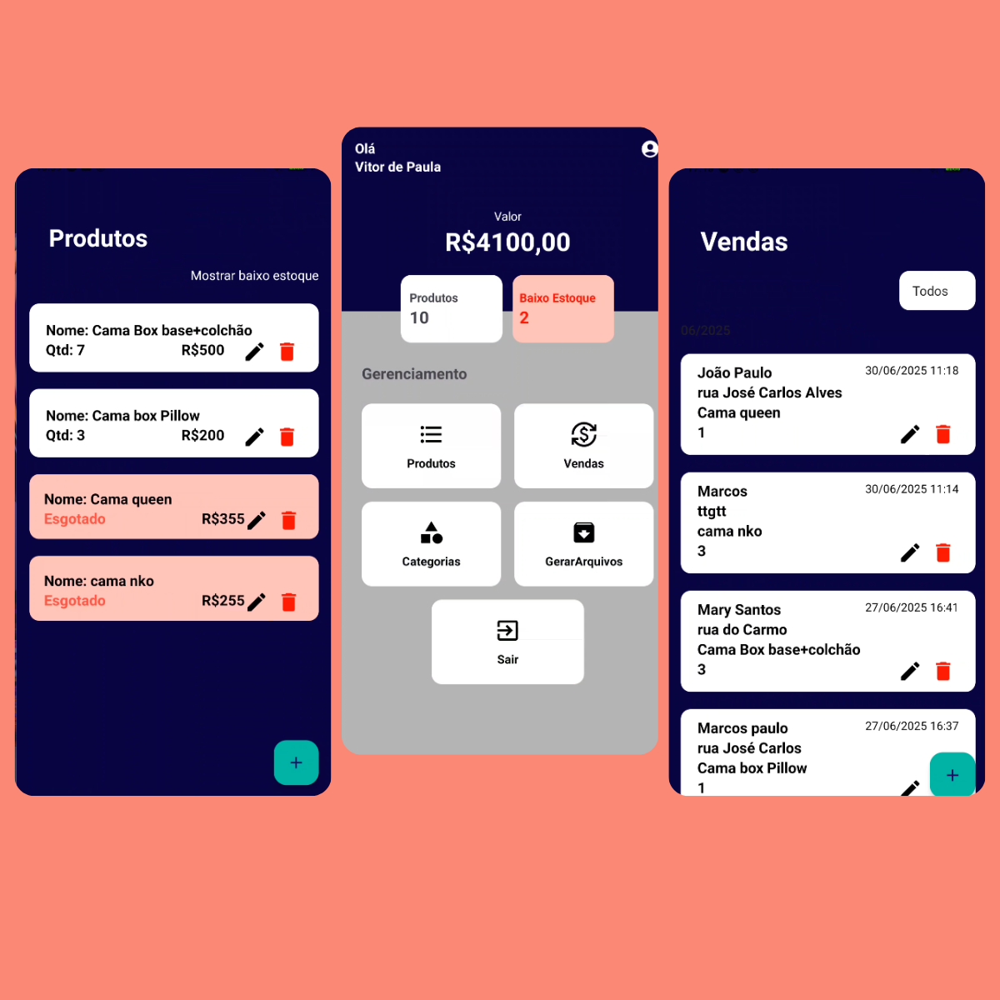

# 📱 InvBrasil


---

O **InvBrasil** é um aplicativo Android desenvolvido em **Kotlin**, criado para ajudar microempresas a gerenciar seu **estoque** e **controle de vendas** de forma simples e eficiente.  
O objetivo é facilitar a gestão diária de pequenos comércios, oferecendo recursos que reduzem a dificuldade no acompanhamento de produtos e relatórios.

---

## ✨ Funcionalidades

- ✅ Cadastro de Produtos  
- ✅ Cadastro de Usuários  
- ✅ Relatório de Vendas em PDF  
- ✅ Gerenciamento de Estoque  

---

## 🛠️ Tecnologias Utilizadas

- [Kotlin](https://kotlinlang.org/)  
- [XML](https://developer.android.com/guide/topics/ui)  
- [Room](https://developer.android.com/training/data-storage/room)  
- [Clean Architecture](https://developer.android.com/jetpack/guide)  
- [iText PDF](https://itextpdf.com/)  

---

## 📸 Demonstração



---

## 🚀 Como Executar o Projeto

### ✅ Pré-requisitos
- Android Studio **Hedgehog ou superior**  
- Dispositivo Android com **Android 10 (API 29)** ou superior  
- JDK 11  

### ▶️ Passos
```bash
# Clone o repositório
git clone https://github.com/VitorPgms/InvBrasil1


# Abrir no Android Studio
- Abra o Android Studio
- Clique em File > Open
- Selecione a parta do projeto

# Sincronizar Dependências
O projeto utiliza Gradle. O Android Studio deve sincronizar automaticamente, mas se não:
- Clique em File > Sync Project with Gradle Files

# Executar o Projeto
- Conecte um dispositivo Android ou use um emulador
- Clique em #Run App
```
# Contribuições são bem-vindas!
Se tiver ideias, sugestões ou encontrar problemas, fique à vontade para abrir uma issue ou enviar um pull request

👨‍💻 Autor

Desenvolvido por Vitor de Paula

